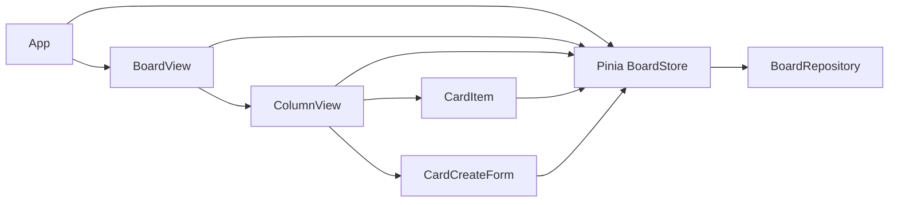

# コンポーネント依存関係 — TaskBoard Mini

## 依存マトリクス（上位 → 下位）

|  | App | BoardView | ColumnView | CardItem | CardCreateForm |
|--|:---:|:-----------:|:------------:|:----------:|:----------------:|
| **Pinia store** | ✓ | ✓ | ✓ | ✓ | ✓ |
| **BoardRepository** | — | — | — | — | —（ストア経由） |

- **Repository** は **ストアのみ**が直接参照。Vue コンポーネントは **Repository を直接 import しない**。

---

## データフロー（テキスト）

1. **起動**: `App` → `boardStore.loadFromStorage()` → `LocalStorageBoardRepository.load()` → ストア更新 → `BoardView` 描画。
2. **変更**: ユーザー操作 → コンポーネント → **ストアのメソッド** → 状態更新 → 必要に応じ `saveToStorage()` → `Repository.save()`。
3. **再読込**: ブラウザリロード → 1 と同様。

---

## Mermaid（依存の向き）

### テキスト代替

- UI ツリー: `App` → `BoardView` → `ColumnView` → `CardItem` / `CardCreateForm`
- 全 UI → `BoardStore` → `BoardRepository`

---

## 結合度

- **列・カード**は `columnId` / `cardId` でストアと疎結合。
- 永続化形式の変更は **Repository** のみ差し替えで吸収。
