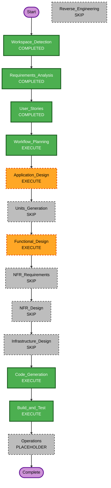

# Execution Plan — TaskBoard Mini

## Detailed Analysis Summary

### プロジェクト種別

- **Greenfield**（既存アプリコードなし）。Reverse Engineering は対象なし。

### Change Impact Assessment

| 観点 | 内容 |
|------|------|
| **User-facing changes** | Yes — 新規タスクボード UI（列・カード・永続化） |
| **Structural changes** | Yes — 新規 Vue SPA 構成（ルートにアプリコード） |
| **Data model changes** | Yes — クライアント側のボード状態モデル（列・カード） |
| **API changes** | No — バックエンド API なし（要件） |
| **NFR impact** | Yes — 静的ホスト、ブラウザ永続化、PBT、モダンブラウザ対象 |

### Risk Assessment

| 項目 | 評価 |
|------|------|
| **Risk Level** | **Medium**（状態管理・永続化・PBT の組み合わせ） |
| **Rollback Complexity** | Easy（フロントのみ・デプロイロールバック） |
| **Testing Complexity** | Moderate（PBT＋コンポーネント／結合） |

---

## フェーズ判定（推奨）

### INCEPTION

| ステージ | 判定 | 理由 |
|----------|------|------|
| Workspace Detection | **COMPLETED** | 実施済み |
| Reverse Engineering | **SKIP** | Greenfield |
| Requirements Analysis | **COMPLETED** | 実施済み |
| User Stories | **COMPLETED** | 実施済み（ユーザー承認済み） |
| Workflow Planning | **EXECUTE** | 本ドキュメント |
| Application Design | **EXECUTE** | 新規コンポーネント（ボード・列・カード）、永続化層、状態の責務分担の定義が必要 |
| Units Generation | **SKIP** | 単一デプロイ可能なフロントエンド 1 ユニットのため、複数ユニットへの分解は過剰 |

### CONSTRUCTION

| ステージ | 判定 | 理由 |
|----------|------|------|
| Functional Design | **EXECUTE** | ボード状態モデル、serialize/deserialize、PBT での性質特定（要件 4.1・TB-06） |
| NFR Requirements | **SKIP** | 技術スタック（Vue・静的ホスト・ブラウザ保存）は要件で固定済み。追加の NFR 意思決定が少ない |
| NFR Design | **SKIP** | NFR Requirements をスキップするため |
| Infrastructure Design | **SKIP** | マネージド IaC／クラウド構成なし（静的ホストのみ） |
| Code Generation | **EXECUTE** | 常に実施 |
| Build and Test | **EXECUTE** | 常に実施 |

### OPERATIONS

| ステージ | 判定 |
|----------|------|
| Operations | **PLACEHOLDER** |

---

## Workflow Visualization

### Mermaid（構文検証済み）

### テキスト代替（Mermaid が表示できない場合）

1. INCEPTION: Workspace Detection → Requirements Analysis → User Stories → Workflow Planning（本計画）→ Application Design → Units Generation（SKIP）  
2. CONSTRUCTION: Functional Design → NFR（SKIP）→ Infrastructure Design（SKIP）→ Code Generation → Build and Test  
3. OPERATIONS: プレースホルダ

---

## Phases to Execute（チェックリスト）

### INCEPTION PHASE

- [x] Workspace Detection（COMPLETED）
- [x] Reverse Engineering（SKIP — Greenfield）
- [x] Requirements Analysis（COMPLETED）
- [x] User Stories（COMPLETED）
- [x] Workflow Planning（本計画の作成・**ユーザー承認済み**）
- [ ] Application Design — **EXECUTE**（新規 UI・永続化・コンポーネント境界）
- [ ] Units Generation — **SKIP**（単一フロントユニット）

### CONSTRUCTION PHASE

- [ ] Functional Design — **EXECUTE**（状態モデル・PBT 性質・永続化 round-trip）
- [ ] NFR Requirements — **SKIP**（要件でスタック確定）
- [ ] NFR Design — **SKIP**（上記に依存）
- [ ] Infrastructure Design — **SKIP**（静的ホストのみ）
- [ ] Code Generation — **EXECUTE**（必須）
- [ ] Build and Test — **EXECUTE**（必須）

### OPERATIONS PHASE

- [ ] Operations — **PLACEHOLDER**

---

## Package Change Sequence（Brownfield）

該当なし（Greenfield）。

---

## Estimated Timeline

- **想定フェーズ数（実行）**: INCEPTION 2（Application Design, Workflow Planning 完了済み除く）+ CONSTRUCTION 3（Functional Design, Code Generation, Build and Test）  
- **期間**: 未見積（実装規模に依存）

---

## Success Criteria

- **Primary Goal**: 静的ホスト可能な Vue タスクボードが TB-01〜TB-06 を満たし、PBT 方針に沿うこと  
- **Key Deliverables**: アプリコード（ルート）、ビルド・テスト手順、設計ドキュメント（該当段階）  
- **Quality Gates**: 要件・ストーリーとのトレーサビリティ、PBT ブロッキングに対する対応（Construction）

---

## 拡張ルールとの関係

- **Security Baseline**: 無効 — 実行計画上は Infrastructure／本番ハードニングはスコープ外だが、公開時は別レビューを推奨（要件どおり）。  
- **Property-Based Testing**: 有効（フル）— Functional Design・Code Generation で必ず考慮。
